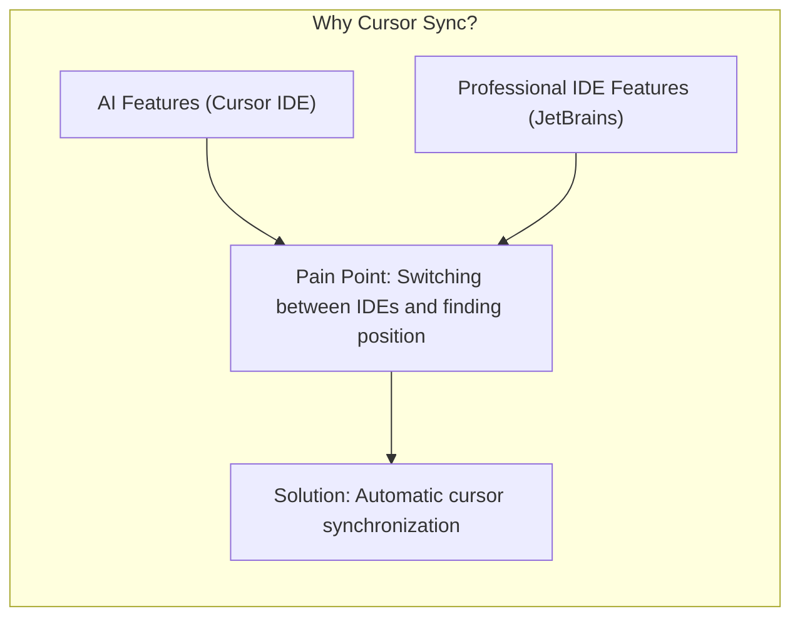
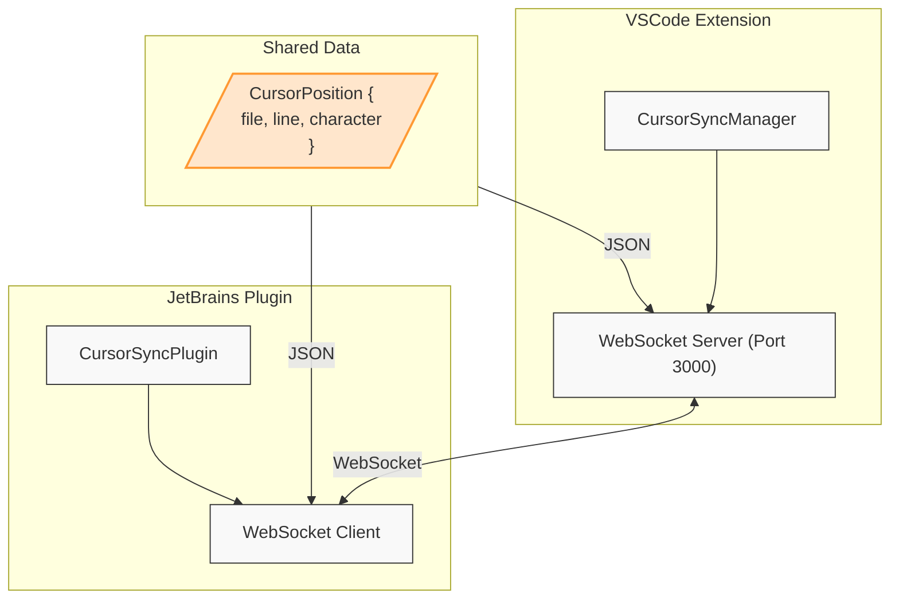

# Cursor Sync Plugin

A plugin that synchronizes cursor positions between VSCode and JetBrains IDEs.

This is very much a work in progress. Please look at the [issues](https://github.com/andrewgazelka/cursor-sync/issues) for more information.

https://github.com/user-attachments/assets/acf66818-32f4-4695-9f2c-8486fdba73bc

## Reasoning

## Architecture

## Build Instructions

### VSCode Plugin
1. Navigate to the `vscode-plugin` directory
2. Run `npx vsce package`
3. When prompted, respond with 'y'
4. A file named `cursor-sync-0.0.1.vsix` will be generated
5. Install by dragging and dropping this file into the extensions panel of your VSCode-compatible editor

### JetBrains Plugin
1. Navigate to the `jetbrains-plugin` directory
2. Run `./gradlew buildPlugin`
3. The plugin will be generated at `build/distributions/jetbrains-plugin-1.0-SNAPSHOT.zip`
4. Install via "Install Plugin from Disk" in your JetBrains IDE
